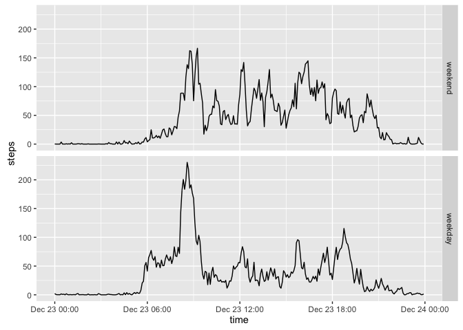

# Reproducible Research: Peer Assessment 1


## Loading and preprocessing the data


```r
data <- read.csv('activity.csv')
data$interval <- sprintf('%02d:%02d',data$interval%/%100, data$interval%%100)
data$time <- strptime(with(data, paste(date, interval)), '%Y-%m-%d %H:%M')
```


## What is mean total number of steps taken per day?

```r
d <- data[!is.na(data$steps), ]
steps_perday <- sapply(split(d,d$date), function(x) sum(x$steps))
hist(steps_perday)
```

 


```r
mean(steps_perday)
```

```
## [1] 9354.23
```

```r
median(steps_perday)
```

```
## [1] 10395
```


## What is the average daily activity pattern?


```r
steps <- sapply(split(d, d$interval), function(x) mean(x$step))
plot(strptime(names(steps), format='%H:%M'), steps, type='l', xlab='time')
```

 

Which 5-minute interval, on average across all the days in the dataset, contains the maximum number of steps?

```r
names(which.max(steps))
```

```
## [1] "08:35"
```

## Imputing missing values
Calculate and report the total number of missing values in the dataset

```r
sum(is.na(data$steps))
```

```
## [1] 2304
```

Create a new dataset that is equal to the original dataset but with the missing data filled in, using the mean for that 5-minute interval

```r
nasteps <- is.na(data$steps)
data_new <- data
data_new$steps[nasteps] <- steps[data_new$interval[nasteps]]
```


```r
steps_perday_new <- sapply(split(data_new,data_new$date), function(x) sum(x$steps))
hist(steps_perday_new)
```

 

```r
mean(steps_perday_new)
```

```
## [1] 10766.19
```

```r
median(steps_perday_new)
```

```
## [1] 10766.19
```
These values are greater than the estimates from the first part, 

## Are there differences in activity patterns between weekdays and weekends?

```r
data_new$weekday <- weekdays(data_new$time) == 'Sunday' | weekdays(data_new$time) == 'Saturday'
data_new$weekday <- factor(data_new$weekday, label=c('Weekday', 'Weekend'))
d_weekend <- data_new[data_new$weekday=='Weekend',]
d_weekday<- data_new[data_new$weekday=='Weekday',]
head(d_weekday)
```

```
##       steps       date interval                time weekday
## 1 1.7169811 2012-10-01    00:00 2012-10-01 00:00:00 Weekday
## 2 0.3396226 2012-10-01    00:05 2012-10-01 00:05:00 Weekday
## 3 0.1320755 2012-10-01    00:10 2012-10-01 00:10:00 Weekday
## 4 0.1509434 2012-10-01    00:15 2012-10-01 00:15:00 Weekday
## 5 0.0754717 2012-10-01    00:20 2012-10-01 00:20:00 Weekday
## 6 2.0943396 2012-10-01    00:25 2012-10-01 00:25:00 Weekday
```

```r
steps_weekend <- sapply(split(d_weekend, d_weekend$interval), function(x) mean(x$step))
steps_weekday <- sapply(split(d_weekday, d_weekday$interval), function(x) mean(x$step))

par(mfrow = c(2,1), mar = c(3,3,1,1))
plot(strptime(names(steps_weekday), format='%H:%M'), steps_weekday, type='l')
plot(strptime(names(steps_weekend), format='%H:%M'), steps_weekend, type='l')
title(sub=c('weekday','weekend'))
```

 
